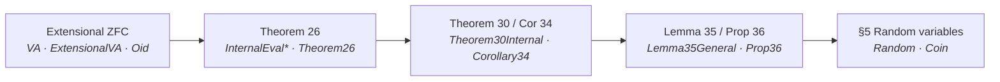
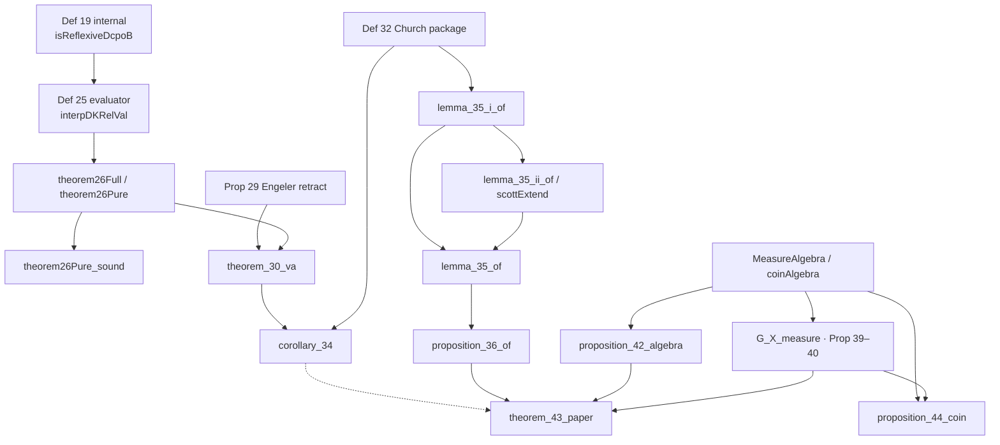

# A Lean 4 Development of Interpreting Lambda Calculus in Domain-Valued Random Variables (CSL 2026)

**Author.** Lars Warren Ericson (Catskills Research Company).
**Source paper.** Robert Furber, Radu Mardare, Prakash Panangaden, and Dana Scott,
*Interpreting Lambda Calculus in Domain-Valued Random Variables*, LIPIcs,
Vol. 363, CSL 2026, Article 48.
**Repository.** https://github.com/catskillsresearch/scott2026

---

## Abstract

This note records a Lean 4 / mathlib formalization of Furber, Mardare,
Panangaden, and Scott's 2026 CSL paper *Interpreting Lambda Calculus in
Domain-Valued Random Variables*. The paper develops Boolean-valued set theory
and domain theory from scratch and shows how the $\lambda$-calculus can be
interpreted using domain-valued random variables, building on Dana Scott's
vision of Boolean-valued models for probabilistic higher-type programming.

The library in `Scott2026/` is sorry-free and project-axiom-free. It covers
the paper's Boolean-valued universe $V^A$, the internal Engeler model,
Theorems 26 and 30, Corollary 34, the general Lemma 35 / Proposition 36
oracle calculus, the measure algebra $A(X)=\Sigma/\mathcal{N}$,
Propositions 39–42, Theorem 43, and Proposition 44. Domain-theory background
is imported from a vendored copy of
[`scott1972`](https://github.com/catskillsresearch/scott1972) at
`vendor/scott1972` (frozen SHA in `vendor/FROZEN.txt`). The development is
packaged for [Palomar](https://palomar-registry.org/about) with a Challenge /
Solution pair and `formalization.yaml` metadata.

The paper's authors were not contacted and did not participate in, review, or
endorse this formalization. Lean is written by AI agents under the direction
and review of the author, who takes sole responsibility for the mathematical
content.

Proofs in this note are compact. Where a Lean argument fits in about ten
lines, the snippet is copied from the library; otherwise the note states the
theorem and points to the implementation in `Scott2026/`. The complete source
is generated as Appendix A of the review copy
(`scripts/generate_arxiv_with_code.sh` → `arxiv_with_code.md`).

<!-- AI_MODEL_TOOL_BULLETS -->
<!-- /AI_MODEL_TOOL_BULLETS -->

## 1. Introduction

Boolean-valued models of set theory were introduced so that independence
results—most famously the continuum hypothesis—could be read as statements
about names and Boolean truth values rather than as metatheoretic
constructions of forcing extensions [Sco67, Bell, Jech]. Scott later asked
whether the same idea could serve *semantics*: if the Boolean algebra $A$ is
a measure algebra, then an $A$-valued set is a random variable taking values
in a domain, and the internal language of $V^A$ becomes a language of
almost-sure statements about higher-type computation.

The CSL 2026 paper carries that program through for the untyped
$\lambda$-calculus. It rebuilds, internally, the ingredients of a reflexive
domain: $A$-posets, Scott continuity, the Engeler graph model
$\mathcal{P}^A(\check{E})$, Church numerals, and a many-one comparison of
subsets of $\mathbb{N}$ defined by $\lambda$-terms. The application
(Theorem 43) produces two subsets of $\mathbb{N}$ that are incomparable
under that $\lambda$-definable preorder, using independent fair coins as
the underlying negligibility space. Proposition 44 records that one cannot
shortcut the argument by treating $L^0(X;\mathcal{P}(Y))$ as a continuous
dcpo: when $A(X)$ is non-atomic, it is not.

This formalization follows the paper's numbered statements in dependency
order. Weaker or special-case Lean theorems keep their original names;
paper-type statements are introduced beside them (`theorem_30_va` beside
`theorem_30`, `lemma_35_of` beside Engeler `lemma_35`, and so on). The
working source is `sources/Scott2026.pdf`, with a searchable transcription
in `sources/Scott2026_vision.md`. A related long version is
[arXiv:2112.06339](https://arxiv.org/abs/2112.06339).

Three methodological choices are worth stating up front.

1. **Extensional ZFC boundary.** Ground sets are read through Mathlib's
   `ZFSet` quotient. Raw `PSet` representatives remain an implementation
   device, used only where structural recursion needs them.
2. **Nontrivial Boolean algebras.** The paper's distinctions
   ($\bot\neq\top$, numeral separation, strictness of $\mathrm{Oid}(D)$)
   have no intended meaning in the one-element algebra. Lean states
   `[Nontrivial A]` exactly where those distinctions appear.
3. **Measure algebra as $\Sigma/\mathcal{N}$.** The paper's $A(X)$ is the
   quotient of *measurable* sets by null sets (`MeasureAlgebra`). An
   all-sets presentation (`NegligibilitySpace.measurableRep`) is retained
   but is strictly stronger than Borel coin space can inhabit.

The formalization is **classical**. Every completed proof reports the
standard mathlib footprint `[propext, Classical.choice, Quot.sound]`.

## 2. Scope and layout

The sorry-free development is about 38,000 lines across 38 Lean modules
under `Scott2026/`, plus the vendored Scott 1972 continuous-lattice
library. Deliberate proof holes occur only in the Mathlib-only
`Challenge.lean`. The Palomar compared inventory is a Mathlib-expressible
subset of Proposition 27; the remaining paper-type theorems are
kernel-checked in the library and re-exported by `Solution.lean`.

| Module cluster | Role |
| --- | --- |
| `VA`, `ExtensionalVA`, `Oid`, `Setoid`, `RelFun` | Boolean-valued names, $A$-setoids, mixing |
| `InternalDomain`, `InternalInterp`, `InternalEval*` | Internal Definition 19 and the Theorem 26 evaluator |
| `Theorem26`, `Theorem30Internal`, `Corollary34` | Internal interpretation and Engeler in $V^A$ |
| `Domain`, `Lambda`, `Interp`, `Lemma35General`, `Prop36` | Ground reflexive dcpos, Church calculus, oracles |
| `Random`, `Coin` | Measure algebra, $L^0$, $G_X$, Propositions 42–44 |
| `Basic` | Re-exports and inventory comments |
| `Challenge` / `Solution` | Palomar statement of record vs sorry-free proofs |

`Scott1972` is compiled from `vendor/scott1972` (`srcDir`; pin `a198b6e`,
see `vendor/FROZEN.txt`), not as a Lake path/git dependency, so Palomar's
sandbox need not write outside `.lake/`.

## 3. How the proofs use Mathlib

The paper rebuilds a large fragment of Boolean-valued set theory and
domain theory. Mathlib supplies the algebraic and measure-theoretic
substrate; the paper-specific language ($A$-names, internal Scott
continuity, Church combinators, $G_X$) is developed in `Scott2026/`.

**Order and Boolean algebra.** Complete Boolean algebras, Heyting
implication, and complete lattices come from
`Mathlib.Order.CompleteBooleanAlgebra` and
`Mathlib.Order.CompleteLattice`. Internal predicates (`isFunctionB`,
`isScottContinuousB`, `isReflexiveDcpoB`) are $A$-valued terms in that
algebra, not Prop-valued class-instance searches.

**ZFC presentations.** Mathlib `PSet` / `ZFSet`
(`Mathlib.SetTheory.ZFC`) give a well-founded model of sets. We use
`PSet` only for recursion (Church numerals as `PSet.omega`, pairing
codes) and expose `ZFSet` / `checkExt` at the paper boundary, with
representation-independence lemmas so two equivalent pre-sets cannot
create a spurious failure of strictness.

**Domain theory.** Scott-open sets, way-below, and the injective
extension operator `scottExtend` (Scott 1972, Props 2.11 / 3.8) come
from the vendored `Scott1972` library, which itself sits on Mathlib
topology (`IsEmbedding`, `Continuous`, Scott topology). Lemma 35(ii)
applies `scottExtend` to the discrete numeral subspace and feeds the
extension to `ReflexiveDcpo.lam`.

**Measure theory.** Fair coins are Mathlib Bernoulli measures
(`Probability.Distributions.Bernoulli`) on `Bool`, extended by
`Measure.infinitePi` to $2^\omega$ and by `Measure.prod` to
$2^\omega\times 2^\omega$. Nullity, countable unions, and
`toMeasurable` are the usual `MeasureTheory` lemmas. The paper algebra
`MeasureAlgebra μ` is a `Quotient` of `{s // MeasurableSet s}` by
$\mu(s\mathbin{\triangle} t)=0$, with a `CompleteBooleanAlgebra`
instance under `[IsFiniteMeasure μ]` (countable-chain-condition
essential suprema).

**Combinatorics of syntax.** Capture-avoiding substitution needs
`[Infinite Var]`. Countability of closed $\lambda$-terms for Theorem 43
uses an injective `Nat.pair` encoding (`Mathlib.Data.Nat.Pairing`).

What Mathlib does *not* provide, and what this library therefore builds,
is the internal language of $V^A$: Boolean-valued membership and
equality on names, the $\mathrm{Oid}$ equivalence, the relational
evaluator of Definition 25, and the $A(X)$-poset $L^0$.

## 4. Proof dependency structure

The paper's numbered results are not independent modules. The Lean
import graph follows the published order: extensional names, then the
internal evaluator, then Engeler in $V^A$, then numerals and oracles,
then the measure-algebra example.





## 5. Theorem inventory

Paper names and Lean names. Weaker or special-case theorems keep their
original names beside the paper-type theorems.

| Paper | Paper-type Lean name | Weaker / special-case name |
| --- | --- | --- |
| Proposition 27 | `proposition_27` / `proposition_27_finite_*` wrappers | `finite_subsets_countable` |
| Theorem 26 | `theorem26Full` / `theorem26Pure` / `theorem26Pure_sound` | `theorem_26` (Engeler carrier) |
| Theorem 30 | `theorem_30_va` / `theorem_30_internalModel` | `theorem_30` (canonical-carrier) |
| Corollary 34 | `corollary_34` | `corollary_34_check` |
| Lemma 35 | `lemma_35_of` / `lemma_35_i_of` / `lemma_35_ii_of` | `lemma_35` (Engeler) |
| Proposition 36 | `proposition_36_of` | `proposition_36` (Engeler) |
| Proposition 42 | `proposition_42_algebra` | `proposition_42` (raw `coinMeasure`) |
| Theorem 43 | `theorem_43_paper` | `theorem_43` (external oracles) |
| Proposition 44 | `proposition_44_coin` / `_measure` / `_dcpo` | `proposition_44` (all-sets algebra) |

Further named results: `definition_25` / `interp`, `lemma_31`,
`definition_32`, `proposition_33`, `churchNotN` / `churchTest` /
`churchWithNumerals`, `MeasureAlgebra` / `coinAlgebra` / `coinS1` /
`coinS2`, `G_X_measure`, `proposition_39_measure`,
`proposition_40_measure`, `lemma_41_measure` / `lemma_41_algebra`,
`not_isAtomic_coinAlgebra`.

Compared Palomar declarations: `csl2026` (Theorem 43) and
`proposition_36_i`. The Solution proof of `csl2026` uses
`csl2026_capstones` (`theorem26Full`, `corollary_34`, `theorem_43_paper`).

## 6. Proof notes

This section records strategy where the mechanization has to say more
than the published text, and shows a short Lean fragment when the
library proof is short. Longer constructions are cited by file.

### 6.1 Boolean-valued set theory and $\mathrm{Oid}$

Jech's lemmas on mixing, fullness, and $\Delta_0$ reflection are
`jech_lemma_14_18`, `theorem_1_iii`, and `jech_lemma_14_21`. The
categorical equivalence between $A$-setoids and extensional names is
`setAEquivSetoidR`. Completeness, totality, and strictness of
$\mathrm{Oid}(\mathcal{P}^A(X))$ are `theorem_17_va_*` /
`proposition_28_va_*`. These are the substrate for every later
internal statement: an internal function name is an $A$-valued
relation that is single-valued and total at Boolean degree $\top$,
then packaged as a `SetoidFHom` by Definition 16.

### 6.2 Theorem 26 — internal interpretation

Definition 25 interprets $\Lambda(D,\mathrm{Var},\mathfrak{K})$ by
recursion on terms, in the internal language. The difficulty the paper
leaves implicit is that abstraction must survive *fuzzy* environment
updates: the body is interpreted along a pointwise Scott-continuous
family, not a crisp substitution. The library therefore proves a
fundamental lemma quantifying over `IsPointwiseFamily` environments
(`InternalEvalFamily`, `InternalEvalComplete`), identifies application
and abstraction body graphs as Scott-continuous maps into the internal
function space $C$, and only then packs an evaluator name
`interpDKGraph` (`InternalEvalPack`).

`theorem26Full` is then Definition 16 applied to that name:

```lean
noncomputable def theorem26Full
    (𝓜 : InternalReflexiveModel (A := A))
    (V K : AName.{u} A) (hK : subsetB K 𝓜.D = ⊤)
    (hV : (oid V).IsTotal)
    (η : RelFun (oid V) (oid 𝓜.D)) :
    SetoidFHom (oid (lamDKB 𝓜.D V K)) (oid 𝓜.D) :=
  theorem26FullOfFunctionName 𝓜.D V K
    (InternalReflexiveModel.interpDKGraph 𝓜 V K hK hV η)
    (InternalReflexiveModel.interpDKGraph_isFunctionB 𝓜 V K hK hV η)
    𝓜.complete
```

Soundness `theorem26Pure_sound` is the full `LamEq` theory
(reflexivity, symmetry, transitivity, congruence, $\xi$, capture-avoiding
$\beta$, $\alpha$). The extra hypothesis actually needed is
`OidSeparated V` (distinct variable keys are Boolean-unequal), together
with `[Infinite V.idx]` for `Lam.substCA`. The Engeler-only
`theorem_26` on `Set ℕ` is kept as a weaker packaging. Full proof:
`Scott2026/InternalEvalComplete.lean`, `InternalEvalPack.lean`,
`Theorem26.lean`.

### 6.3 Theorem 30 and Corollary 34 — Engeler in $V^A$

Proposition 29's `app`/`lam` pair is internalized as names
`engelerFun` and `engelerLamB` on $D=\mathcal{P}^A(\check{\omega})$.
The retract $\mathbf{fun}\circ\mathbf{lam}=\mathrm{id}_C$ uses Scott
continuity of $G\in C$ on the directed family of finite subsets, plus
membership of ground finite sets in the checked $\omega$. The six-tuple
of Definition 19 then has Boolean value $\top$:

The packaging of Corollary 34 is a conjunction, so the library proof
is a tuple of already-proved conjuncts.

```lean
theorem corollary_34 [Nontrivial A] :
    isReflexiveDcpoB engelerD engelerR engelerC engelerQ
      engelerFun engelerLamB = ⊤ ∧
    isContinuousLatticeSubsetB engelerD = ⊤ ∧
    isBaseSubsetB (pfinB (checkExt PSet.omega)) engelerD = ⊤ ∧
    Corollary34Check ∧
    (eqB (childΩ (interpClosedVA churchTrue))
         (childΩ (interpClosedVA churchFalse)) = ⊥) ∧
    (∀ n m, eqB (childΩ (interpClosedVA (churchNum n)))
                (childΩ (interpClosedVA (churchNum m))) = ⊤ → n = m) :=
  ⟨theorem_30_va, isContinuousLatticeSubsetB_powerB _,
    isBaseSubsetB_pfinB_powerB _, corollary_34_check,
    eqB_interpClosedVA_churchTrue_churchFalse,
    fun n m h => churchNum_interpClosedVA_injective h⟩
```

(`[Nontrivial A]` is required for `checkExt` and for the last two
conjuncts.) Full proof: `Scott2026/Theorem30Internal.lean`,
`Corollary34.lean`.

### 6.4 Lemma 35 — discrete numerals and oracles

The paper derives closed tests $\mathbf{m}^?$ from Definition 32's
`if`, `pred`, and $0?$, then uses Scott-open separators and (for part
(ii)) injectivity of continuous lattices. In Lean, `churchNotN` and
`churchTest` live on `ℕ` so that `interpClosed_sound_full` applies
(`[Infinite Var]`). Transfer of the $\lambda$-equations is one rewrite:

```lean
theorem interpClosed_churchNotN_true {D : Type u} [CompleteLattice D]
    (R : ReflexiveDcpo D) :
    R.app (interpClosed R churchNotN) (interpClosed R churchTrueN) =
      interpClosed R churchFalseN := by
  rw [← interpClosed_app]
  exact interpClosed_sound_full (Var := ℕ) R churchNotN_true
```

Numeral injectivity is the paper's function argument: if
$\llbracket c_m\rrbracket=\llbracket c_n\rrbracket$ then
$\mathbf{fun}(\llbracket m^?\rrbracket)$ cannot send one to $\top$ and
the other to $\bot$ (`numeral_inj_of_churchTest`). Part (ii) embeds the
numeral subspace, notes that discreteness makes
$g(\llbracket c_n\rrbracket)=\chi_A^D(n)$ continuous, and extends by
`scottExtend` (Scott 1972). The retract identity
`lemma_35_ii_of_extension` turns $\mathbf{lam}\,\bar g$ into the
oracle. Full proof: `Scott2026/Lambda.lean`, `Lemma35General.lean`.

### 6.5 Proposition 36 — $\lambda$-definable many-one comparison

On a reflexive *continuous* lattice with Church numerals, paper (i)
(some oracles) and (ii) (all oracles) are equivalent because Lemma
35(ii) supplies at least one pair. The library proof is exactly that
pair of implications; `ManyOneLe` (an arbitrary $f:\mathbb{N}\to\mathbb{N}$)
is kept separate, and the converse
`ManyOneLe → proposition_36_i` is not claimed
(`exists_nat_fun_not_lambda_definable`).

```lean
theorem proposition_36_of {D : Type*} [CompleteLattice D]
    (R : ReflexiveDcpo D)
    (hbool : interpClosed R churchTrueN ≠ interpClosed R churchFalseN)
    (hcont : Scott1972.ContinuousLattice.IsContinuousLattice D)
    (S₁ S₂ : Set ℕ) :
    proposition_36_i_of R hbool S₁ S₂ ↔
      proposition_36_ii_of R hbool S₁ S₂ :=
  ⟨proposition_36_ii_of_i_of R hbool,
    proposition_36_i_of_ii_of R hbool hcont⟩
```

### 6.6 Measure algebra, $G_X$, and Proposition 42

`MeasureAlgebra μ` quotients measurable sets. The Boolean value of a
measurable event is $\bot$ exactly when the event is null:

```lean
theorem mk_eq_bot [IsFiniteMeasure μ] {s : Set X}
    {hs : MeasurableSet s} :
    mk μ s hs = (⊥ : MeasureAlgebra μ) ↔ μ s = 0 := by
  rw [← mk_bot, mk_eq_iff, ae_empty_iff]
```

Equation (5) is `coinS1 n = mk (D1 n true)` (and likewise `coinS2`).
Proposition 39–40 and Lemma 41 are restated on this algebra as
`proposition_39_measure`, `proposition_40_measure`,
`lemma_41_measure`; the un-suffixed names remain the all-sets
`AssociatedAlgebra` forms. Proposition 42's algebra form is four
Boolean values equal to $\bot$: no finite standard preimage of $S_1$
or $S_2$, and neither $S_1=\check f^{-1}(S_2)$ nor the swap. Each
conjunct is a Mathlib null-set calculation already in
`proposition_42`, lifted by `mk_eq_bot`.

```lean
theorem proposition_42_algebra (f : ℕ → ℕ) :
    ((⨆ K : Finset ℕ, ⨅ n, (coinS1 n ⇨ checkSet ↑K (f n)) ⊓
        (checkSet ↑K (f n) ⇨ coinS1 n)) = ⊥) ∧
    ((⨆ K : Finset ℕ, ⨅ n, (coinS2 n ⇨ checkSet ↑K (f n)) ⊓
        (checkSet ↑K (f n) ⇨ coinS2 n)) = ⊥) ∧
    ((⨅ n, (coinS1 n ⇨ coinS2 (f n)) ⊓ (coinS2 (f n) ⇨ coinS1 n)) = ⊥) ∧
    ((⨅ n, (coinS2 n ⇨ coinS1 (f n)) ⊓ (coinS1 (f n) ⇨ coinS2 n)) = ⊥) :=
  ⟨iSup_eq_bot.mpr fun K => coinS1_finite_preimage_eq_bot f K,
    iSup_eq_bot.mpr fun K => coinS2_finite_preimage_eq_bot f K,
    coinS1_preimage_S2_eq_bot f, coinS2_preimage_S1_eq_bot f⟩
```

The finite-$K$ join is over `Finset ℕ`, not the full internal
$\mathcal{P}_{\mathrm{fin}}^A(\check\omega)$. Full proof:
`Scott2026/Random.lean`, `Coin.lean`.

### 6.7 Theorem 43 — incomparable $\lambda$-degrees

The paper applies Theorem 1 to Lemma 35(ii) *inside* $V^A$, transports
along $G_X^{-1}$, and intersects countably many conull sets. The
library proof `theorem_43_paper` follows that *mathematical* recipe
with one honest substitution of tools: oracles are fiberwise ground
Lemma 35(ii) (`chiOracle` on the bit-sets), mixed as $L^0$ maps and
pushed through `G_X_measure`, rather than a direct `theorem_1_iii`
witness on an internalized Lemma 35 formula. Application is the
existing Engeler operation `engelerAppA`. After Proposition 42 makes
each numeral-mapping $M$ null, countability of `Lam ℕ`
(`lamEncode_injective`) and `measure_univ = 1` produce a point $x$;
$T_i=\{n\mid a_i(x)\cdot\llbracket c_n\rrbracket=\llbracket\top\rrbracket\}$
and Proposition 36 give both non-reducibility conclusions.

The statement is short; the construction of the conull set is not, so
this note does not copy the body. After `exists_mem_paperGoodSet` the
library defines $T_i$ as the set of $n$ with
$a_i(x)\cdot\llbracket c_n\rrbracket=\llbracket\top\rrbracket$ and
finishes with `proposition_36_i` in `Scott2026/Coin.lean`. The
external-oracle theorem `theorem_43` is unchanged and has the same type.

### 6.8 Proposition 44 — $L^0$ is not a continuous dcpo

On a complete lattice the paper's “continuous dcpo” is the existing
way-below-sup predicate (`IsContinuousDcpo` aliases
`IsContinuousLattice`). Transport along $G_X$ reduces the claim to:
the function space of a non-atomic complete Boolean algebra is not a
continuous lattice. Fair-coin `coinAlgebra` is non-atomic because any
positive class splits along a first-sequence bit (or else determines
that sequence and is null). Full proof: `proposition_44_coin` in
`Coin.lean`; the AssociatedAlgebra form `proposition_44` is kept.

## 7. Source fidelity

Working source: `sources/Scott2026.pdf`. Vision transcription:
`sources/Scott2026_vision.md` (produced by `scripts/ocr_pdf_pipeline.sh`).

### 7.1 Foundational convention

We read the paper's ground sets extensionally, in ZFC. The Lean
formalization therefore exposes ground-set parameters through Mathlib's
`ZFSet`; `PSet` is used only as an implementation-level well-founded
presentation behind proved representation-independence lemmas. Boolean
names use the quotient domain `AName.Dom`, and checked sets use
`checkExt`, so duplicate pre-set presentations cannot create spurious
failures of strictness.

We also believe the paper implicitly assumes that the complete Boolean
algebra $A$ is nontrivial. Statements that distinguish Boolean truth
values or require $\bot\neq\top$ therefore state `[Nontrivial A]`
explicitly. This is necessary: for the one-element Boolean algebra all
Boolean equalities simultaneously have values $\top$ and $\bot$, so the
paper's numeral-separation and strictness conclusions cannot have their
intended meaning.

### 7.2 Recorded divergences

- `proposition_42_algebra` finite-$K$ is a `Finset` join (the paper's
  fuzzy `pfinB` exists-quantifier is not fully internalized).
- `theorem_43_paper` uses fiberwise Lemma 35(ii) mixed in
  $L^0$/`G_X_measure`, not a direct `theorem_1_iii` hookup;
  `theorem_43` remains the external-oracle form.
- All-sets `NegligibilitySpace.measurableRep` / `ofMeasure hN` is
  stronger than paper $\Sigma/\mathcal{N}$; paper $A(X)$ is
  `MeasureAlgebra`.
- Engeler-only `lemma_35` / `proposition_36` / `proposition_42` /
  `theorem_43` keep weaker or special-case names.
- The Palomar Challenge locks `csl2026` (Theorem 43) and
  `proposition_36_i`. The capstones `theorem26Full`, `corollary_34`, and
  `theorem_43_paper` are packed in `csl2026_capstones` and remain
  kernel-checked in `Scott2026/`.

## 8. Build and preflight

The repository pins Lean / mathlib **v4.33.0** (`lean-toolchain`).

```bash
lake exe cache get
lake build
bash scripts/palomar_preflight.sh --mechanical-only   # CI / routine
bash scripts/palomar_preflight.sh                     # before Palomar submission
bash scripts/generate_arxiv_with_code.sh              # → arxiv_with_code.md
```

`arxiv_with_code.md` is a generated review copy: this narrative plus
**Appendix A**, a verbatim inlining of every `Scott2026/` Lean file
(~38,000 lines). It is gitignored and stale whenever it is older than
`arxiv.md` or any listed `.lean` file. Do not treat it as the inventory
source of truth.

## 9. License and source PDF

Original Lean and author-written docs: Apache-2.0. `sources/Scott2026.pdf`
and `sources/JechSetTheory2003.pdf` are **not** Apache-2.0; see `NOTICE`
and `sources/README.md`.

<!-- AI_MODEL_REFERENCES -->
<!-- /AI_MODEL_REFERENCES -->
